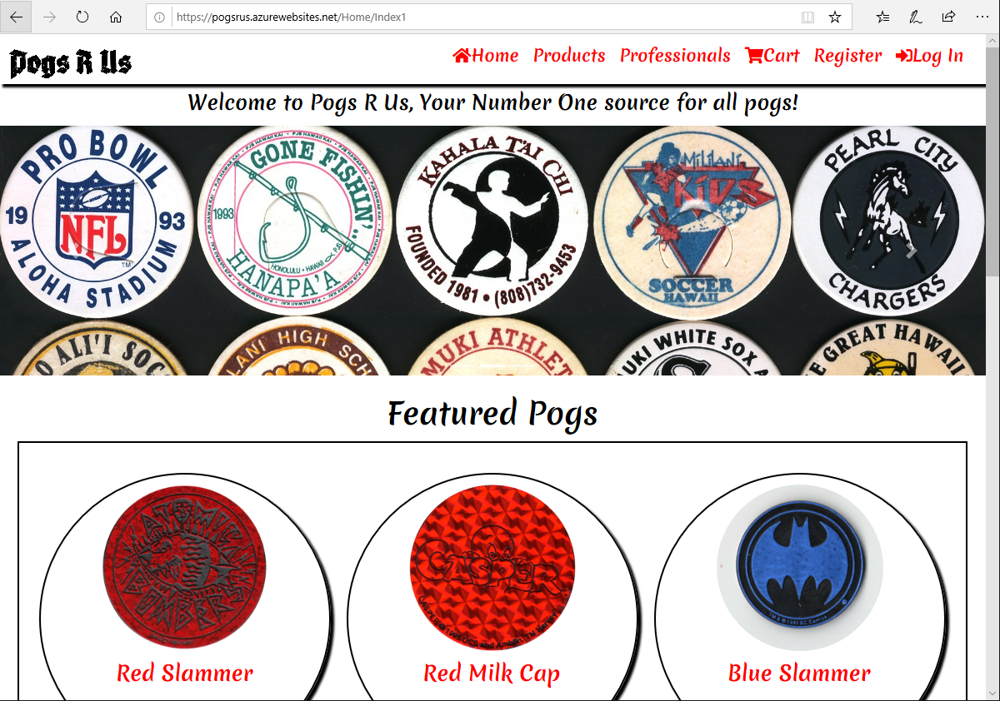
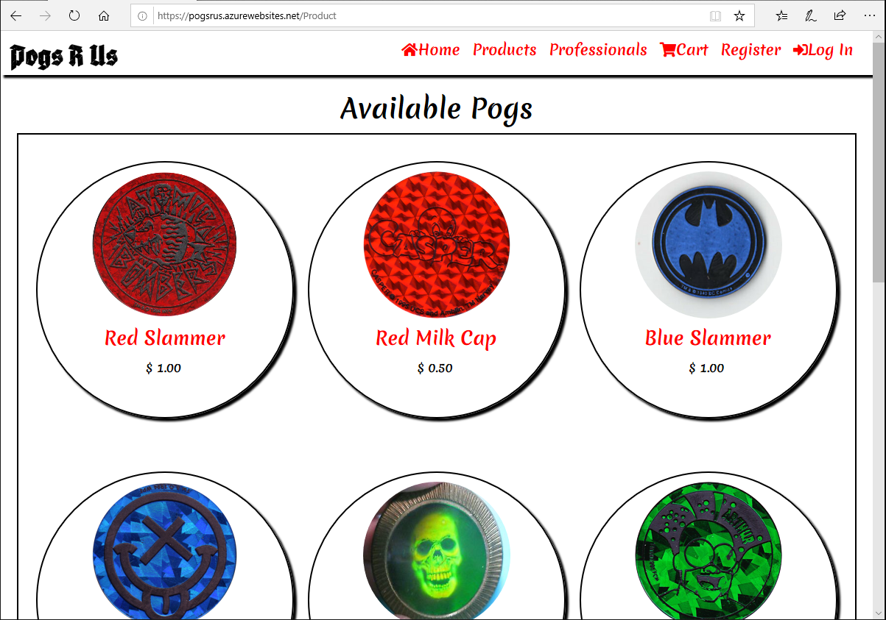

# Introduction 
Pogs R Us offers a one stop shop for for all of you Pogs and Pog Accessories. We also offer a special set of merchandise for Professional Pog Competitors.

#### Link to Deployed Site and Azure DevOps

https://pogsrus.azurewebsites.net/

https://dev.azure.com/TeamGrey/PogsRUs

# Products Avaliable
- Slammers
- Milk Caps
- Pog Receptacles
- Swag

# Views

## Register

- When selecting the Register Tab on the Nav Bar you will be redirected to a Registration Page. From this page you will have the option of creating a standard account for Pogs R Us or be given the option to use an OAuth account to create your Pogs R Us account. 

#### Standard Registration

- You will be asked to fill out a form:
  - First Name
  - Last Name
  - Birthday
  - Email
  - Professional Checkbox
  - Password
  - Confirm Password
- Upon submit you will be logged in and redirected to Home Page

#### OAuth Registration

- Microsoft Account Button
- Google Account Button

##### Microsoft Account Login
  - You will be asked to input your Microsoft Account email address and password and upon submission will have an account on Pogs R Us using your Microsoft Account data. 
- Upon submit you will be logged in and redirected to Home Page
##### Google Account Login
  - You will be asked to input your Google Account email address and password and upon submission will have an account on Pogs R Us using your Google Account data. 
- Upon submit you will be logged in and redirected to Home Page
## Login

- When selecting the Login Tab on the Nav Bar you will be redirected to a Login Page. From this page you will have the option of logging in using Standard Login or OAuth Login.

#### Standard Login

- You will be asked to enter your email associated with Pogs R Us account and your Password.
- Upon submit you will be logged in and redirected to Home Page

#### OAuth Login

##### Microsoft Account Login

- You will be asked to enter your email associated with your Microsoft account and your Password.
- Upon submit you will be logged in and redirected to Home Page

##### Google Account Login

- You will be asked to enter your email associated with your Google account and your Password.
- Upon submit you will be logged in and redirected to Home Page

## Products

- When selecting the Products Tab on the Nav Bar you will be redirected to the Products Page

#### Index Page
- Shows all products that are avaliable on the site.
- Each product will have displayed name and short description as well as a Show Details Button
#### Show Details Page
- When the show details button is pressed a detailed view of the product is shown as well as a Add to Cart Button
#### Add to Cart
- When the Add to Cart Button is pressed the targeted product is added to the users cart if they are logged in.
- If the Add to Cart Button for the same product is pressed again then the quanity of that item increases by one in the cart.
## Cart
- When selecting the Cart Tab on the Nav Bar you will be redirected to the Cart Page
#### Index Page
- The Index page will display all of the Products that you currently have in your cart.
#### Order Button
- At the bottom of the Index page is an Order button which when pressed will take the user to the Receipt Page.
## Receipt
- The Receipt page will display all of the Products that you currently have in your cart along with their quantity and the Total Price of all items in cart.

## Professionals
- Professionals page can only be accessed by a Logged In user who when registering their account selected the Professional checkbox.
- The Professionals page will welcome you to the Circle of Champions and display an image of a Circle of Pog Champions.
## Mini Cart
- Displayed on the top of the homepage and the top of the Products Page if a user is logged in.
- Shows all items currently in cart.

# Claims
#### Fullname Claim
- Name: fullNameClaim
- Purpose: To enable a customized greeting for user experience.

#### Email Claim
- Name: emailClaim
- Purpose: Future use (Admin capabilities mayhaps?)

#### Birthday Claim
- Name: birthdayClaim
- Purpose: Future use (If you are under 30 you will probably need an introduction to what a pog even is...)

#### Professional Claim
- Name: professionalClaim
- Purpose: To restrict access to a pros only page.

# Policies

#### Professionals Only Policy
- Name: ProfessionalsOnly
- Purpose: Only allows users who checked the Professional box on account creation to access the Professional Page.

# Visuals

# Contributors
- Jason Hiskey
- Nate Tibbals

